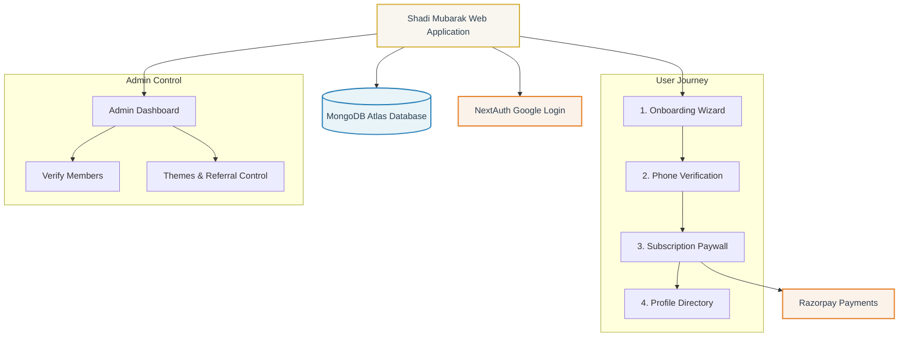

# Shadi Mubarak — Matrimonial Site Notes & Mind Map

This file contains the mind map of the project, details of the folder structure, and key development notes.

---

## 1. Project Mind Map

The mind map below visualizes the architectural components, core integrations, user flows, and database relations of the Shadi Mubarak Matrimonial Site.



---

## 2. Folder Structure

Below is the structured layout of the project, mapping out key files and their purposes.

```text
Gulzar bhai/
├── prisma/
│   └── schema.prisma         # Prisma schema defining User, Account, Session, Profile, and Verification models
├── public/                   # Static assets (images, icons, theme assets)
├── src/
│   ├── app/
│   │   ├── api/              # Route handlers (Server endpoints)
│   │   │   ├── admin/        # Admin endpoints for verification and audit logs
│   │   │   ├── auth/         # NextAuth.js v5 setup endpoints
│   │   │   ├── payment/      # Razorpay payment orders & verification webhook handlers
│   │   │   ├── profile/      # Profile CRUD and completion status handling
│   │   │   └── upload/       # Profile image upload handlers
│   │   ├── favicon.ico       # Site icon
│   │   ├── globals.css       # Core stylesheets, design tokens, responsive typography, and themes
│   │   ├── layout.tsx        # Next.js global wrapper (Root layout with fonts and metadata)
│   │   └── page.tsx          # Main Application Page (Directory, Paywall, Wizard, Admin Simulator, etc.)
│   ├── auth.ts               # NextAuth v5 configuration and middleware helpers
│   └── lib/
│       ├── db.ts             # Global Prisma Client instance initialization
│       └── profileStore.ts   # In-memory simulator fallback & client-side UI state management
├── .env                      # Application environment variables (Secrets, keys, database URLs)
├── .env.example              # Template for environment configuration
├── AGENTS.md                 # Rules & conventions for AI coding agents
├── CLAUDE.md                 # Project instructions / general shortcuts
├── next.config.ts            # Next.js bundler and compiler settings
├── package.json              # Project dependencies, scripts, and runtime engines
├── PROJECT_NOTES.md          # Approved business rules, pricing details, and phase logs
└── tsconfig.json             # TypeScript compiler settings
```

---

## 3. Key Development & Business Notes

### Billing & Pricing Models
* **GST Rate**: A flat rate of **18% GST** must be dynamically appended to all transactions.
* **Standard Monthly Membership**: ₹300 Base + ₹54 GST = **₹354**. Allows users to view unblurred photos & phone numbers.
* **Curated Profiles**: ₹5,500 Base + ₹990 GST = **₹6,490**. Success fee of ₹21,000 on marriage.
* **Second-Marriage Profiles**: ₹11,000 Base + ₹1,980 GST = **₹12,980**.
* **High-Profile Matches**: ₹21,000 Base + ₹3,780 GST = **₹24,780**. Success fee of ₹25,000 on marriage.

### Privacy & Verification Rules
1. **Manual Verification**: Profiles start with status `PENDING` and must be approved by an Admin via telephone verification before they become visible in directory searches.
2. **Privacy Masking**: Unauthenticated users or non-paying users will see blurred profile pictures and masked contact details (phone numbers, email).
3. **Audit Log Trail**: Every change in verification status is audited inside the `AuditLog` table, tracking the admin actor, the target profile, and timestamp.

### Theme & Branding
* The design uses a premium **marriage-card/invitation aesthetic** featuring soft cream backgrounds, refined gold borders, and Islamic geometric SVGs.
* Supports **8 Custom Themes** mapping HSL styling variables globally (e.g. Emerald, Crimson, Gold, Sapphire, Plum, Teal, Terracotta, and Amber).
